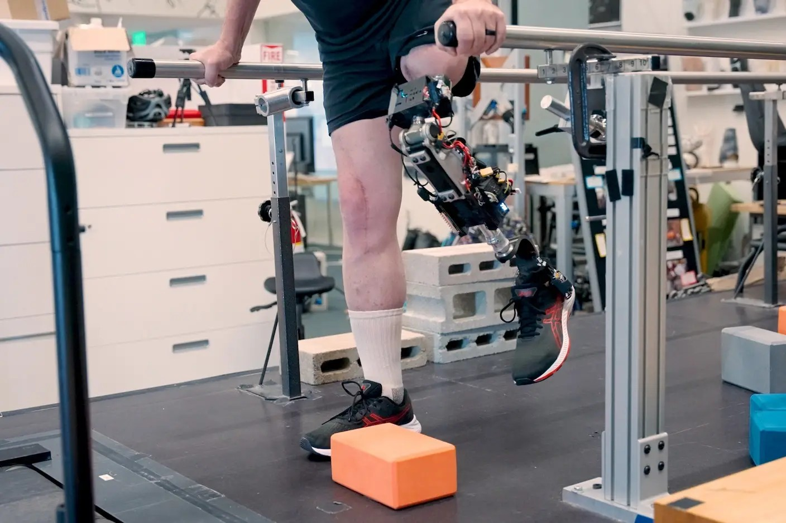


# 첨단 바이오닉 무릎 의족, 실제 다리처럼 느껴지다

-   **그림1:** 새 바이오닉 다리를 착용한 참가자가 계단을 오르는 모습
> 이미지 출처: Courtesy of the researchers / SingularityHub

최근 MIT 연구진이 개발한 **첨단 바이오닉 무릎 의족**이 실제 다리처럼 자연스럽게 느껴진다는 소식이 나왔습니다. 기존 의족과 달리, 이 바이오닉 다리는 사용자의 뼈에 직접 연결되고 근육 신호를 읽어 움직임을 보다 자연스럽게 제어할 수 있어, 실제로 다리의 일부로 느껴진다는 것이 가장 큰 특징입니다.

## 주목할 만한 변화: 의족이 몸의 일부처럼

-   기존 고정형 의족은 걷는 것은 가능하지만, **계단 오르기나 불균형 지면에서의 움직임이 어렵고**, 무릎 위까지 절단된 분들은 특히 더 불편함을 겪었습니다.
    
-   MIT에서 개발된 새 바이오닉 다리는 **경량 구조**와 근육 신호 감지 기술이 포함되어, 실제 다리를 움직이는 것처럼 자연스러운 **무릎의 굽힘과 회전**이 가능합니다.
    
-   실제 시험 참가자들은 **앉았다 일어나기, 계단 오르기, 공 차기** 등을 자유롭게 할 수 있었으며, 무엇보다 “**의족이 외부 장비가 아니라 내 몸의 일부처럼 느껴진다**”는 점을 가장 크게 언급했습니다.
    

## 어떻게 작동할까?

-   새 시스템은 **사용자의 남은 다리 뼈에 금속 막대를 삽입**하고, **남아있는 근육과 신경의 신호**를 전극으로 읽어 의족의 움직임을 제어합니다.
    
-   특히 “AMI 수술”이라는 방법을 써서, 절단 뒤 분리된 근육쌍을 다시 연결해 신경 신호의 전달을 높였습니다. 이 덕분에 **뇌에서 보내는 “움직여라”는 신호가 더 정확하게 전달**되고, 움직임이 자연스러워진 것입니다.
    
-   기존 장착 방식보다 **더 견고하게 의족이 연결**되고, 움직일 때 “내가 움직인다”는 감각과 균형감(고유감각/proprioception)이 크게 향상되었습니다.
    

## 더 적은 통증, 더 실제 같은 감각

-   흔히 절단 뒤에는 사라진 다리가 아직 있는 것처럼 느껴져 통증(유령통)까지 겪는 경우가 많은데, 새 바이오닉 다리가 **통증도 덜어주는 효과**를 보였습니다.
    
-   의족 사용 후 사람들은 “**진짜 두 다리가 있는 것 같다**” “**내가 직접 제어하는 느낌이 든다**”라고 답할 정도로 **높은 만족도와 몰입감(embodiment)**을 나타냈습니다.
    

## 앞으로의 전망

-   연구팀은 현재 미국에서 기존 무릎 아래 절단자에 대한 수술과 적용은 이미 가능하며, 앞으로 **5년 안에 무릎 위 절단자용 바이오닉 다리**도 공식 승인받는 것이 목표입니다.
    
-   의족 기술과 외과 수술법이 함께 발전하면서, 절단 환자들의 일상과 삶의 질이 크게 바뀔 전망입니다.
    

**출처**:

-   Shelly Fan, “Amputees Say Advanced Bionic Leg Feels More Like a Part of Their Body”, SingularityHub, 2025.07.14  
    ([https://singularityhub.com/2025/07/14/amputees-with-bionic-leg-say-it-feels-more-like-a-part-of-their-body/](https://singularityhub.com/2025/07/14/amputees-with-bionic-leg-say-it-feels-more-like-a-part-of-their-body/))
    
